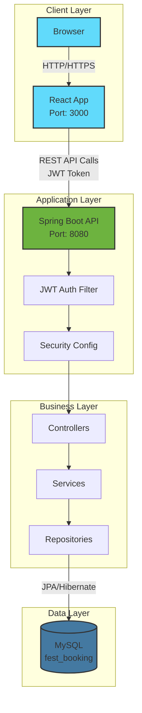
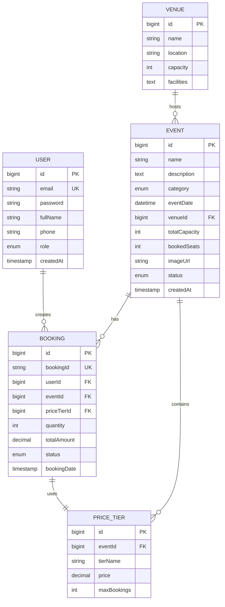

<div align="center">

<!-- Project Banner -->


# 🎊 FESTIFY
### *Where College Festivals Come to Life*

[](https://spring.io/projects/spring-boot)
[](https://reactjs.org/)
[](https://www.mysql.com/)
[](https://www.oracle.com/java/)
[](https://jwt.io/)
[](LICENSE)

**⚡ Lightning-fast • 🎨 Beautiful • 🔒 Secure • 🚀 Production-ready**

[✨ Features](#-features-that-wow) • [🚀 Quick Start](#-quick-start-in-3-minutes) • [🛠️ Tech Stack](#️-tech-stack) • [📸 Screenshots](#-screenshots) • [📚 Documentation](#-api-documentation)

---

</div>

## 🌟 What is FESTIFY?

**FESTIFY** is a next-generation, **full-stack College Festival Event Booking System** that transforms campus event management. Built with enterprise-grade technologies and an offline-first architecture, it delivers a **seamless, instant booking experience** from discovery to confirmation.

> 💡 **Perfect For**: Tech Fests • Cultural Events • Workshops • Sports Tournaments • Hackathons • Campus Celebrations

### 🎯 Why Choose FESTIFY?

<table>
<tr>
<td width="50%">

**🚀 For Users**
- ⚡ Instant booking confirmations (no waiting!)
- 🎨 Stunning glassmorphism UI with background videos
- 📱 Fully responsive across all devices
- 🔍 Smart event discovery with search & filters
- 🎫 Digital ticket generation with booking history
- 💳 Multi-tier pricing (Early Bird, Regular, VIP)

</td>
<td width="50%">

**🛡️ For Administrators**
- 📊 Real-time analytics dashboard
- 🎪 Complete event lifecycle management
- 👥 User management & role-based access
- 🏛️ Venue capacity tracking
- 💰 Revenue monitoring per event/tier
- 📈 Booking trend visualization

</td>
</tr>
</table>

---

## ✨ Features That WOW

### 👥 **Student Experience**

<details open>
<summary><b>🔍 Event Discovery</b></summary>

- Browse stunning event cards with category filters
- Search events by name, category, or date
- View detailed event information with immersive visuals
- Background video integration for premium feel
- Real-time capacity and availability tracking

</details>

<details open>
<summary><b>🎟️ Seamless Booking</b></summary>

- Select from multiple price tiers (Early Bird, Regular, VIP)
- Visual seat selection interface
- Instant booking confirmation with confetti animation 🎉
- Auto-generated booking reference numbers
- Email notifications (optional integration)

</details>

<details open>
<summary><b>✨ User Dashboard</b></summary>

- View all bookings in one place
- Download digital tickets
- Track upcoming and past events
- Manage user profile and preferences
- Beautiful, intuitive interface

</details>

### 👑 **Admin Superpowers**

<details open>
<summary><b>📊 Analytics Dashboard</b></summary>

- **Real-time Stats**: Total bookings, revenue, active events
- **Visual Charts**: Booking trends, revenue distribution
- **Capacity Monitoring**: See sell-out predictions
- **User Analytics**: Registration trends, engagement metrics

</details>

<details open>
<summary><b>🎪 Event Management</b></summary>

| Feature | Description |
|---------|-------------|
| **Create Events** | Rich form with all event details, pricing tiers, and venue assignment |
| **Update Events** | Edit any event detail, adjust pricing, update capacity |
| **Delete Events** | Safe deletion with cascade handling |
| **Status Control** | Activate/deactivate events, mark as sold out |
| **Bulk Operations** | Manage multiple events efficiently |

</details>

<details open>
<summary><b>🏛️ Venue & User Management</b></summary>

- Create and manage venues with capacity limits
- Assign events to specific venues
- View all registered users
- Role-based access control (Admin/Student)
- Track booking patterns per user

</details>

### 🔧 **Technical Excellence**

```
✅ JWT Authentication        → Secure, stateless auth with refresh tokens
✅ Spring Security           → Industry-standard authorization
✅ Input Validation          → Comprehensive DTO validation
✅ CORS Configuration        → Seamless frontend-backend integration
✅ Layered Architecture      → Clean separation: Controller → Service → Repository
✅ Auto Data Seeding         → Pre-populated demo data for instant testing
✅ Dual Database Support     → MySQL (production) + H2 (quick demos)
✅ Error Handling            → Global exception handling with meaningful messages
✅ Clean Code                → Lombok-powered, boilerplate-free Java
```

---

## 🚀 Quick Start (in 3 Minutes!)

### 📋 Prerequisites

| Requirement | Version | Download Link |
|------------|---------|---------------|
| ☕ Java | 17+ | [Adoptium JDK](https://adoptium.net/) |
| 🗄️ MySQL | 8.0+ | [MySQL Download](https://dev.mysql.com/downloads/mysql/) |
| 📦 Node.js | 18+ | [NodeJS](https://nodejs.org/) |
| 🔧 Maven | 3.8+ | Included via wrapper |

---

### 🎬 Installation Steps

#### **Step 1: Clone the Repository**

```bash
git clone https://github.com/xxxASHxxx/college-fest-booking-system.git
cd college-fest-booking-system
```

#### **Step 2: Setup MySQL Database**

```bash
# Start MySQL (Windows)
net start mysql80

# Or (Linux/Mac)
sudo systemctl start mysql

# Create database
mysql -u root -p
CREATE DATABASE fest_booking;
EXIT;
```

#### **Step 3: Configure Application (Optional)**

Default configuration works out-of-the-box! But if needed, edit:

**Backend**: `src/main/resources/application.properties`
```properties
spring.datasource.url=jdbc:mysql://localhost:3306/fest_booking
spring.datasource.username=root
spring.datasource.password=hello  # Change if your password differs
```

**Frontend**: Already configured to connect to `http://localhost:8080`

#### **Step 4: Start Backend (Spring Boot)**

```bash
# Windows
.\mvnw.cmd spring-boot:run

# Linux/Mac
./mvnw spring-boot:run
```

✅ Backend runs on: **http://localhost:8080**  
⏳ Wait 30-40 seconds for "Started CollegeFestBookingApplication"

#### **Step 5: Start Frontend (React)**

Open a **new terminal**:

```bash
cd fest-booking-ui
npm install  # First time only
npm start
```

✅ Frontend runs on: **http://localhost:3000**  
🌐 Opens automatically in your browser!

---

### 🎭 Demo Accounts (Auto-Created)

| 👤 Email | 🔑 Password | 🎖️ Role | 🔓 Access |
|----------|-----------|---------|----------|
| `admin@festbook.com` | `admin123` | 👑 **Admin** | Full dashboard access, event management, analytics |
| `student1@college.edu` | `student123` | 🎓 **Student** | Browse events, create bookings, view history |
| `student2@college.edu` | `student123` | 🎓 **Student** | Regular user account |
| `student3@college.edu` | `student123` | 🎓 **Student** | Regular user account |

---

### 🎪 Pre-loaded Events (Ready to Book!)

The system automatically seeds **5 exciting events**:

| Event | 🏛️ Venue | 👥 Capacity | 💰 Price Tiers |
|-------|----------|------------|---------------|
| 🎵 **Starlight Music Fest 2026** | Main Auditorium | 500 | ₹299 / ₹499 / ₹799 |
| 💻 **Tech Innovation Summit** | Open Air Theatre | 1000 | ₹199 / ₹299 / ₹499 |
| ⚽ **Annual Sports Championship** | Sports Complex | 300 | ₹99 / ₹199 / ₹299 |
| 🎭 **Cultural Night: Colors of India** | Main Auditorium | 500 | ₹149 / ₹249 / ₹399 |
| 🚀 **HackFest 2026** | Tech Hub | 200 | ₹0 (Free) |

---

## 🛠️ Tech Stack

### **Backend Architecture** 🏗️

```
┌─────────────────────────────────────────────┐
│         Spring Boot 3.2.1 Backend           │
├─────────────────────────────────────────────┤
│  🔐 Spring Security + JWT Authentication    │
│  💾 Spring Data JPA + Hibernate             │
│  ✅ Spring Validation (Bean Validation)     │
│  📧 Spring Mail (Optional)                  │
│  🧹 Lombok (Cleaner Code)                   │
│  ☕ Java 17 (Latest LTS)                    │
└─────────────────────────────────────────────┘
           │
           ▼
┌─────────────────────────────────────────────┐
│           Database Layer                     │
├─────────────────────────────────────────────┤
│  🗄️ MySQL 8.0 (Production)                  │
│  🗃️ H2 Database (Quick Demos)                │
└─────────────────────────────────────────────┘
```

**Core Dependencies**:
- `spring-boot-starter-web` - RESTful APIs
- `spring-boot-starter-data-jpa` - Database ORM
- `spring-boot-starter-security` - Authentication & Authorization
- `mysql-connector-j` - MySQL driver
- `jjwt` (0.12.3) - JWT token generation & validation
- `lombok` - Reduces boilerplate code

### **Frontend Architecture** ⚛️

```
┌─────────────────────────────────────────────┐
│          React 19.2.3 Frontend              │
├─────────────────────────────────────────────┤
│  🧭 React Router DOM 7.13 (Client Routing)  │
│  📡 Axios 1.13.2 (HTTP Client)              │
│  🎨 Tailwind CSS 3.4 (Styling)              │
│  🔣 React Icons 5.5 (Icon Library)          │
│  🎉 React Toastify (Notifications)          │
│  🎊 Canvas Confetti (Celebrations)          │
│  🔳 qrcode.react (QR Generation)            │
│  ✨ Lucide React (Premium Icons)            │
└─────────────────────────────────────────────┘
```

**Build Tool**: `react-scripts` 5.0.1 (Create React App)  
**Testing**: `@testing-library/react` 16.3.2

---

## 📐 System Architecture



---

## 📂 Project Structure

<details>
<summary><b>🗂️ Complete Directory Tree (Click to Expand)</b></summary>

```
college-fest-booking-system/
│
├── 📂 fest-booking-ui/              # React Frontend (Port 3000)
│   ├── public/
│   │   ├── festify.png              # App logo
│   │   ├── festmainvideo.mp4        # Hero section background (Git LFS)
│   │   ├── allred.mp4               # Events page background (Git LFS)
│   │   └── festenjoy.mp4            # Additional media (Git LFS)
│   │
│   ├── src/
│   │   ├── components/
│   │   │   ├── common/              # Reusable UI components (89 files)
│   │   │   │   ├── Navbar.jsx
│   │   │   │   ├── Footer.jsx
│   │   │   │   ├── Button.jsx
│   │   │   │   ├── Card.jsx
│   │   │   │   ├── Modal.jsx
│   │   │   │   ├── Input.jsx
│   │   │   │   ├── Badge.jsx
│   │   │   │   ├── Avatar.jsx
│   │   │   │   ├── Tabs.jsx
│   │   │   │   ├── Toggle.jsx
│   │   │   │   ├── Pagination.jsx
│   │   │   │   ├── EmptyState.jsx
│   │   │   │   └── ...
│   │   │   │
│   │   │   ├── event/
│   │   │   │   ├── EventCard.jsx
│   │   │   │   ├── EventDetails.jsx
│   │   │   │   ├── EventGrid.jsx
│   │   │   │   └── FeaturedEvents.jsx
│   │   │   │
│   │   │   ├── booking/
│   │   │   │   ├── BookingForm.jsx
│   │   │   │   ├── BookingCard.jsx
│   │   │   │   ├── SeatMap.jsx
│   │   │   │   └── CheckoutForm.jsx
│   │   │   │
│   │   │   └── admin/
│   │   │       ├── AdminDashboard.jsx
│   │   │       ├── EventManagement.jsx
│   │   │       └── UserManagement.jsx
│   │   │
│   │   ├── pages/
│   │   │   ├── HomePage.jsx
│   │   │   ├── EventsPage.jsx
│   │   │   ├── EventDetailsPage.jsx
│   │   │   ├── BookingPage.jsx
│   │   │   ├── MyBookingsPage.jsx
│   │   │   ├── ProfilePage.jsx
│   │   │   └── auth/
│   │   │       ├── LoginPage.jsx
│   │   │       └── RegisterPage.jsx
│   │   │
│   │   ├── services/
│   │   │   ├── api.js               # Axios instance with JWT interceptor
│   │   │   ├── authService.js       # Auth API calls
│   │   │   ├── eventService.js      # Event API calls
│   │   │   └── bookingService.js    # Booking API calls
│   │   │
│   │   ├── context/
│   │   │   ├── AuthContext.jsx      # Auth state management
│   │   │   ├── CartContext.jsx      # Booking cart
│   │   │   └── ThemeContext.jsx     # Theme preferences
│   │   │
│   │   ├── routes/
│   │   │   └── index.jsx            # React Router configuration
│   │   │
│   │   ├── utils/
│   │   │   ├── constants.js         # App constants
│   │   │   ├── formatters.js        # Date/currency formatters
│   │   │   └── validators.js        # Input validation
│   │   │
│   │   ├── App.js                   # Main app component
│   │   ├── index.js                 # React entry point
│   │   └── index.css                # Global styles
│   │
│   ├── package.json
│   └── README.md
│
├── 📂 src/main/
│   ├── java/com/collegefest/booking/
│   │   │
│   │   ├── controller/              # REST API Endpoints (7 Controllers)
│   │   │   ├── AuthController.java       # POST /api/auth/login, /register
│   │   │   ├── EventController.java      # CRUD /api/events
│   │   │   ├── BookingController.java    # POST /api/bookings
│   │   │   ├── VenueController.java      # CRUD /api/venues
│   │   │   ├── UserController.java       # GET /api/users/profile
│   │   │   ├── AdminDashboardController.java  # GET /api/admin/stats
│   │   │   └── TicketController.java     # GET /api/tickets/{id}
│   │   │
│   │   ├── service/                 # Business Logic Layer
│   │   │   ├── AuthService.java
│   │   │   ├── EventService.java
│   │   │   ├── BookingService.java
│   │   │   ├── UserService.java
│   │   │   ├── VenueService.java
│   │   │   ├── TicketService.java
│   │   │   └── DashboardService.java
│   │   │
│   │   ├── repository/              # Data Access Layer (JPA)
│   │   │   ├── UserRepository.java
│   │   │   ├── EventRepository.java
│   │   │   ├── BookingRepository.java
│   │   │   ├── VenueRepository.java
│   │   │   └── PriceTierRepository.java
│   │   │
│   │   ├── entity/                  # JPA Entities (Database Models)
│   │   │   ├── User.java            # Users table
│   │   │   ├── Event.java           # Events table
│   │   │   ├── Booking.java         # Bookings table
│   │   │   ├── Venue.java           # Venues table
│   │   │   ├── PriceTier.java       # Price tiers (Early, Regular, VIP)
│   │   │   └── Ticket.java          # Generated tickets
│   │   │
│   │   ├── security/                # Security Configuration
│   │   │   ├── JwtAuthenticationFilter.java
│   │   │   ├── JwtTokenProvider.java
│   │   │   ├── SecurityConfig.java
│   │   │   └── UserDetailsServiceImpl.java
│   │   │
│   │   ├── dto/                     # Data Transfer Objects
│   │   │   ├── request/
│   │   │   │   ├── LoginRequest.java
│   │   │   │   ├── RegisterRequest.java
│   │   │   │   ├── BookingRequest.java
│   │   │   │   └── EventRequest.java
│   │   │   │
│   │   │   └── response/
│   │   │       ├── AuthResponse.java
│   │   │       ├── BookingResponse.java
│   │   │       ├── EventResponse.java
│   │   │       └── DashboardStatsResponse.java
│   │   │
│   │   ├── config/                  # Application Configuration
│   │   │   ├── CorsConfig.java
│   │   │   ├── DataSeederConfig.java     # Seeds demo data on startup
│   │   │   └── WebConfig.java
│   │   │
│   │   └── exception/               # Exception Handling
│   │       ├── GlobalExceptionHandler.java
│   │       ├── ResourceNotFoundException.java
│   │       └── ValidationException.java
│   │
│   └── resources/
│       ├── application.properties        # MySQL configuration
│       └── application-dev.properties    # H2 config (optional)
│
├── 📂 target/                       # Compiled backend (generated)
│   └── booking-0.0.1-SNAPSHOT.jar
│
├── .gitattributes                   # Git LFS configuration for video files
├── .gitignore
├── pom.xml                          # Maven dependencies
├── mvnw / mvnw.cmd                  # Maven wrapper
├── LICENSE
└── README.md                        # 👈 You are here!
```

</details>

---

## 🔌 API Documentation

### **Base URL**: `http://localhost:8080`

### 🔐 **Authentication Endpoints**

| Method | Endpoint | Description | Auth Required | Request Body |
|--------|----------|-------------|---------------|--------------|
| `POST` | `/api/auth/register` | Register new user | ❌ | `{email, password, fullName, phone}` |
| `POST` | `/api/auth/login` | Login & receive JWT | ❌ | `{email, password}` |
| `POST` | `/api/auth/refresh` | Refresh access token | 🔐 | `{refreshToken}` |
| `GET` | `/api/auth/user` | Get current user info | 🔐 | - |

**Login Example**:
```bash
curl -X POST http://localhost:8080/api/auth/login \
  -H "Content-Type: application/json" \
  -d '{"email":"student1@college.edu","password":"student123"}'
```

**Response**:
```json
{
  "accessToken": "eyJhbGciOiJIUzI1NiIs...",
  "refreshToken": "eyJhbGciOiJIUzI1NiIs...",
  "user": {
    "id": 1,
    "email": "student1@college.edu",
    "fullName": "Student One",
    "role": "STUDENT"
  }
}
```

---

### 🎪 **Event Endpoints**

| Method | Endpoint | Description | Auth | Response |
|--------|----------|-------------|------|----------|
| `GET` | `/api/events` | Get all events | ❌ | Array of events |
| `GET` | `/api/events?category=TECH` | Filter by category | ❌ | Filtered events |
| `GET` | `/api/events/{id}` | Get event details | ❌ | Single event |
| `POST` | `/api/events` | Create new event | 👑 Admin | Created event |
| `PUT` | `/api/events/{id}` | Update event | 👑 Admin | Updated event |
| `DELETE` | `/api/events/{id}` | Delete event | 👑 Admin | Success message |
| `GET` | `/api/events/{id}/price-tiers` | Get pricing tiers | ❌ | Array of tiers |

**Create Event Example**:
```bash
curl -X POST http://localhost:8080/api/events \
  -H "Authorization: Bearer <JWT_TOKEN>" \
  -H "Content-Type: application/json" \
  -d '{
    "name": "Winter Festival",
    "description": "Annual winter celebration",
    "category": "CULTURAL",
    "eventDate": "2026-12-15T18:00:00",
    "venueId": 1,
    "totalCapacity": 500,
    "imageUrl": "https://example.com/image.jpg"
  }'
```

---

### 🎫 **Booking Endpoints**

| Method | Endpoint | Description | Auth | Request Body |
|--------|----------|-------------|------|--------------|
| `POST` | `/api/bookings` | Create booking | 🔐 | `{eventId, priceTierId, quantity}` |
| `GET` | `/api/bookings/user` | Get user's bookings | 🔐 | - |
| `GET` | `/api/bookings/{id}` | Get booking details | 🔐 | - |
| `DELETE` | `/api/bookings/{id}` | Cancel booking | 🔐 | - |
| `GET` | `/api/bookings/event/{eventId}` | Get event bookings | 👑 Admin | - |

**Create Booking Example**:
```bash
curl -X POST http://localhost:8080/api/bookings \
  -H "Authorization: Bearer <JWT_TOKEN>" \
  -H "Content-Type: application/json" \
  -d '{
    "eventId": 1,
    "priceTierId": 2,
    "quantity": 2
  }'
```

**Response**:
```json
{
  "bookingId": "BK-2026-001234",
  "eventName": "Starlight Music Fest 2026",
  "quantity": 2,
  "totalAmount": 998.00,
  "status": "CONFIRMED",
  "bookingDate": "2026-02-07T20:55:00"
}
```

---

### 👑 **Admin Dashboard Endpoints**

| Method | Endpoint | Description | Auth | Response |
|--------|----------|-------------|------|----------|
| `GET` | `/api/admin/stats` | Dashboard statistics | 👑 Admin | Stats object |
| `GET` | `/api/admin/users` | List all users | 👑 Admin | User array |
| `GET` | `/api/admin/bookings` | All bookings | 👑 Admin | Booking array |

**Dashboard Stats Response**:
```json
{
  "totalEvents": 5,
  "totalBookings": 127,
  "totalRevenue": 45670.00,
  "totalUsers": 234,
  "recentBookings": [...],
  "popularEvents": [...]
}
```

---

### 🏛️ **Venue Endpoints**

| Method | Endpoint | Description | Auth |
|--------|----------|-------------|------|
| `GET` | `/api/venues` | Get all venues | ❌ |
| `GET` | `/api/venues/{id}` | Get venue details | ❌ |
| `POST` | `/api/venues` | Create venue | 👑 Admin |
| `PUT` | `/api/venues/{id}` | Update venue | 👑 Admin |
| `DELETE` | `/api/venues/{id}` | Delete venue | 👑 Admin |

---

## 🗄️ Database Schema



### **Tables Overview**:

| Table | Purpose | Key Fields |
|-------|---------|------------|
| `users` | User accounts | email, password (bcrypt), role (ADMIN/STUDENT) |
| `events` | Event information | name, category, eventDate, venue, capacity |
| `venues` | Event locations | name, location, max capacity |
| `bookings` | Booking records | bookingId, userId, eventId, status, amount |
| `price_tiers` | Pricing options | tierName (Early Bird/Regular/VIP), price |

---

## 📸 Screenshots

<div align="center">

### 🏠 **Landing Page** - Stunning Hero with Background Video


*Immersive hero section with festmainvideo.mp4 background and smooth animations*

---

### 📋 **Event Discovery** - Browse & Search Events


*Beautiful event cards with category filters, search, and allred.mp4 background*

---

### 🎟️ **Event Details** - Complete Event Information


*Detailed event view with pricing tiers, capacity tracker, and instant booking*

---

### 👑 **Admin Dashboard** - Real-time Analytics


*Comprehensive analytics with charts, booking trends, and revenue tracking*

---

### 🎉 **Booking Confirmation** - Success with Confetti


*Instant confirmation with confetti animation and booking reference number*

</div>

---

## 🔒 Security Features

| Feature | Implementation | Description |
|---------|----------------|-------------|
| 🔐 **JWT Authentication** | `jjwt` 0.12.3 | Stateless, secure token-based auth |
| 🔑 **Password Encryption** | BCrypt | Industry-standard hashing (strength 12) |
| 🛡️ **CORS Protection** | Spring Security | Configured allowed origins |
| ✅ **Input Validation** | Bean Validation | All DTOs validated with `@Valid` |
| 🚫 **SQL Injection** | JPA/Hibernate | Parameterized queries only |
| 🔍 **XSS Prevention** | React | Automatic escaping of user input |
| 🎯 **RBAC** | Spring Security | Role-based access (Admin/Student) |
| 🔄 **Token Refresh** | Custom logic | Automatic token renewal |

---

## 🌐 Environment Configuration

### **Backend Configuration**

File: `src/main/resources/application.properties`

```properties
# ===========================
# DATABASE CONFIGURATION
# ===========================
spring.datasource.url=jdbc:mysql://localhost:3306/fest_booking
spring.datasource.username=root
spring.datasource.password=hello
spring.datasource.driver-class-name=com.mysql.cj.jdbc.Driver

# ===========================
# JPA / HIBERNATE
# ===========================
spring.jpa.hibernate.ddl-auto=update
spring.jpa.show-sql=true
spring.jpa.properties.hibernate.dialect=org.hibernate.dialect.MySQLDialect
spring.jpa.properties.hibernate.format_sql=true

# ===========================
# JWT CONFIGURATION
# ===========================
jwt.secret=your-secure-256-bit-secret-key-change-this-in-production
jwt.expiration=86400000
jwt.refresh.expiration=604800000

# ===========================
# SERVER CONFIGURATION
# ===========================
server.port=8080
server.error.include-message=always

# ===========================
# LOGGING
# ===========================
logging.level.com.collegefest.booking=DEBUG
logging.pattern.console=%d{yyyy-MM-dd HH:mm:ss} - %msg%n
```

### **Frontend Configuration**

File: `.env.development` (root directory)

```env
# API Configuration
VITE_API_BASE_URL=http://localhost:8080

# App Metadata
VITE_APP_NAME=FESTIFY
VITE_APP_VERSION=1.0.0

# Feature Flags
VITE_ENABLE_ANALYTICS=false
VITE_ENABLE_EMAIL=false
```

---

## 🧪 Testing & Validation

### **Manual Testing Checklist**

✅ **User Registration & Login**
```bash
# 1. Open http://localhost:3000
# 2. Click "Register" → Fill form → Submit
# 3. Login with created credentials
# 4. Verify JWT token in localStorage
```

✅ **Event Browsing**
```bash
# 1. Visit /events page
# 2. Test search functionality
# 3. Filter by category (TECH, CULTURAL, SPORTS)
# 4. Click on event card → View details
```

✅ **Booking Flow**
```bash
# 1. Select an event → Click "Book Now"
# 2. Choose price tier (Early Bird/Regular/VIP)
# 3. Select quantity → Confirm booking
# 4. Verify confetti animation & booking ID
# 5. Check "My Bookings" page
```

✅ **Admin Functions** (Login as admin@festbook.com)
```bash
# 1. Access /admin dashboard
# 2. View analytics stats
# 3. Create new event → Verify in events list
# 4. Edit existing event → Save changes
# 5. View all bookings & users
```

### **API Testing with Postman**

[](https://www.postman.com/)

1. Import collection: `FESTIFY-API.postman_collection.json` (create this file with all endpoints)
2. Set environment variable: `BASE_URL = http://localhost:8080`
3. Test all endpoints with sample data

---

## 📦 Deployment Guide

### **Development Build**

```bash
# Backend (local testing)
./mvnw spring-boot:run

# Frontend (local testing)  
cd fest-booking-ui
npm start
```

### **Production Build**

#### **1. Build Backend JAR**

```bash
./mvnw clean package -DskipTests
# Output: target/booking-0.0.1-SNAPSHOT.jar

# Run production JAR
java -jar target/booking-0.0.1-SNAPSHOT.jar
```

#### **2. Build Frontend Static Files**

```bash
cd fest-booking-ui
npm run build
# Output: build/ folder

# Serve with any static server
npx serve -s build -p 3000
```

### **Docker Deployment (Coming Soon!)**

```yaml
# docker-compose.yml (Future Enhancement)
version: '3.8'
services:
  mysql:
    image: mysql:8.0
    environment:
      MYSQL_DATABASE: fest_booking
      MYSQL_ROOT_PASSWORD: root
    ports:
      - "3306:3306"
  
  backend:
    build: .
    ports:
      - "8080:8080"
    depends_on:
      - mysql
  
  frontend:
    build: ./fest-booking-ui
    ports:
      - "3000:80"
```

---

## 🤝 Contributing

We ❤️ contributions! Here's how you can help make FESTIFY even better:

### **Getting Started**

1. 🍴 **Fork the repository**
   ```bash
   git clone https://github.com/xxxASHxxx/college-fest-booking-system.git
   ```

2. 🌿 **Create a feature branch**
   ```bash
   git checkout -b feature/amazing-feature
   ```

3. 💻 **Make your changes**
   - Follow existing code patterns
   - Add comments for complex logic
   - Write meaningful commit messages

4. ✅ **Test your changes**
   - Ensure all existing features work
   - Test new functionality thoroughly

5. 💾 **Commit your changes**
   ```bash
   git commit -m "feat: add amazing feature"
   ```
   
   **Commit Convention**:
   - `feat:` New feature
   - `fix:` Bug fix
   - `docs:` Documentation changes
   - `style:` Code style changes
   - `refactor:` Code refactoring
   - `test:` Test additions/changes

6. 📤 **Push to your fork**
   ```bash
   git push origin feature/amazing-feature
   ```

7. 🔃 **Open a Pull Request**
   - Describe your changes clearly
   - Reference related issues
   - Wait for review

### **Code Style Guidelines**

- **Backend (Java)**:
  - Use Lombok annotations (`@Data`, `@Builder`, etc.)
  - Follow Spring Boot best practices
  - Use meaningful variable names
  - Add JavaDoc for public methods

- **Frontend (React)**:
  - Use functional components with hooks
  - Follow React best practices
  - Use descriptive component names
  - Add PropTypes or TypeScript (future)

---

## 🗺️ Roadmap

### **Q1 2026**
- [ ] 📱 Mobile responsive improvements
- [ ] 🌙 Dark mode support
- [ ] 🔔 Real-time notifications (WebSocket)
- [ ] 📧 Email notification integration

### **Q2 2026**
- [ ] 💳 Payment gateway (Razorpay/Stripe)
- [ ] 🎫 QR code ticket scanning
- [ ] 📊 Advanced analytics dashboard
- [ ] 🔍 Advanced search with filters

### **Q3 2026**
- [ ] 📱 React Native mobile app
- [ ] 🌍 Multi-language support (i18n)
- [ ] 🎨 Customizable themes
- [ ] 📈 SEO optimization

### **Q4 2026**
- [ ] 🐳 Docker & Kubernetes deployment
- [ ] 🔄 CI/CD pipeline setup
- [ ] 🧪 Comprehensive test suite
- [ ] 📚 API documentation with Swagger

---

## 🐛 Known Issues & Limitations

| Issue | Severity | Workaround | Status |
|-------|----------|------------|--------|
| ⚠️ H2 database cascade issues | Medium | Use MySQL instead | Won't Fix |
| ⚠️ Payment integration pending | Low | Instant confirmation enabled | Planned Q2 |
| ⚠️ Email service disabled | Low | Works offline without emails | Planned Q1 |
| ⚠️ Large video files (LFS) | Info | Already using Git LFS | ✅ Resolved |

---

## 📜 License

This project is licensed under the **MIT License**.

```
MIT License

Copyright (c) 2026 FESTIFY Team

Permission is hereby granted, free of charge, to any person obtaining a copy
of this software and associated documentation files (the "Software"), to deal
in the Software without restriction, including without limitation the rights
to use, copy, modify, merge, publish, distribute, sublicense, and/or sell
copies of the Software, and to permit persons to whom the Software is
furnished to do so, subject to the following conditions:

The above copyright notice and this permission notice shall be included in all
copies or substantial portions of the Software.

THE SOFTWARE IS PROVIDED "AS IS", WITHOUT WARRANTY OF ANY KIND, EXPRESS OR
IMPLIED, INCLUDING BUT NOT LIMITED TO THE WARRANTIES OF MERCHANTABILITY,
FITNESS FOR A PARTICULAR PURPOSE AND NONINFRINGEMENT.
```

See [LICENSE](LICENSE) file for full details.

---

## 👥 Authors & Contributors

<table>
<tr>
<td align="center">
<br/>
<b>Ashmit</b><br/>
<sub>Creator & Lead Developer</sub><br/>
<a href="https://github.com/xxxASHxxx">GitHub</a>
</td>
<td align="center">
<br/>
<b>You?</b><br/>
<sub>Future Contributor</sub><br/>
<a href="#contributing">Contribute!</a>
</td>
</tr>
</table>

---

## 🙏 Acknowledgments

This project wouldn't be possible without these amazing resources:

- 🎨 **UI/UX Inspiration**: Modern event booking platforms (BookMyShow, Eventbrite)
- 🌐 **Spring Boot**: Excellent framework and community documentation
- ⚛️ **React Team**: For the powerful and intuitive React library
- 🗄️ **MySQL**: Reliable and performant database
- 🎓 **Academic Purpose**: Built as a comprehensive DBMS project demonstrating real-world application development
- 💡 **Open Source Community**: For countless libraries and tools that made this possible

### **Special Thanks**:
- 📚 Stack Overflow community for troubleshooting help
- 🐙 GitHub for hosting and Git LFS support
- 🎨 Google Fonts for beautiful typography
- 🎬 Video assets for immersive UI experience
- ☕ Coffee for keeping the developer awake!

---

## 📞 Support & Contact

Having issues? Need help? We're here!

### **Get Help**:
- 🐛 **Bug Reports**: [GitHub Issues](https://github.com/xxxASHxxx/college-fest-booking-system/issues)
- 💬 **Questions & Discussions**: [GitHub Discussions](https://github.com/xxxASHxxx/college-fest-booking-system/discussions)
- 📧 **Email**: support@festify.com
- 💼 **LinkedIn**: [Connect with Ashmit](https://www.linkedin.com/in/ashmit)

### **Contributing**:
- 🔀 **Pull Requests**: [Create PR](https://github.com/xxxASHxxx/college-fest-booking-system/pulls)
- 📖 **Documentation**: Help improve our docs
- 🌟 **Star the Repo**: If you find this helpful!

---

## 📊 Project Stats

<div align="center">


**Lines of Code**: ~15,000+ | **Files**: 150+ | **Languages**: Java, JavaScript, CSS

</div>

---

<div align="center">

## ⭐ Star this Repository!

**If you found FESTIFY helpful, please consider starring the repository!**

It helps others discover this project and motivates us to keep improving it.

---

### 🚀 Ready to Get Started?

**[⬆️ Back to Quick Start](#-quick-start-in-3-minutes)** | **[📚 View API Docs](#-api-documentation)** | **[🤝 Contribute](#-contributing)**

---

### 💖 Built with Love by the FESTIFY Team

*Making college festivals more accessible, one booking at a time.*

**Last Updated**: February 7, 2026 | **Version**: 1.0.0

---

</div>
